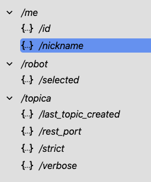
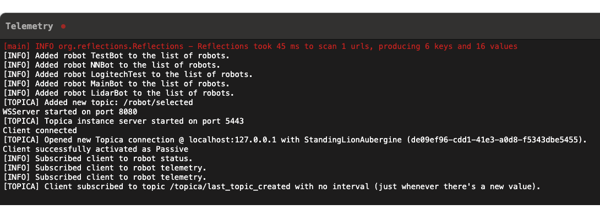

<h1 align="center">
  <br>
  
  <br>
  <b>bot</b>
</h1>

<p align="center">
<a href="https://jaidens-bot-docs.readthedocs.io/en/latest/?badge=latest"></a> <a href="https://jaidenagrimminck.github.io/bot/controlling/docs/javadoc/index.html"></a>
<br/>
<br/>
This repo is both a library and the code for a robot I'm building.
Made by Jaiden.
</p>


## About

This project is supposed to be sort of a capstone project for my senior year of high school... but on a personal level (rather than for school).
It's a fun project that I'm having a great time exploring all sorts of areas from robotics to neural networks.

> [!WARNING]
> This project is in ACTIVE DEVELOPMENT. As such, docs may be (very) out of date and some features may not work.
> If you'd like something to be fixed, feel free to make an issue or contribute by making a pull request.

## Prerequisites

For everything, the following prerequisites are needed:

- Python `3.12`
- npm >= `v9.6.7`
- Java >= `19`

For individual components, look at each of the component sections in this readme for their own prerequisites.

To clone the repository, run

```bash
git clone https://github.com/JaidenAGrimminck/bot.git
```

# Media


https://github.com/user-attachments/assets/110070ed-5c0f-49bf-9240-7cae3323b00f

*the bot in the beginning phases of self-driving/object-avoidance*


https://github.com/user-attachments/assets/e8538c88-3dbe-4262-9000-22e12cc6994f

*an example of the simulator using cross-platform control (network in Python, simulator in Java). video sped up 4x*

https://github.com/user-attachments/assets/dc79bd12-5eaf-474f-9298-c895303d357c

*a quick video of the bot being cadded*

https://github.com/user-attachments/assets/dea046ce-516c-45cd-9a5e-2babb5d9fbf5

*a video of the lidar working in the web dashboard*

# Components

Since this repo is made up of several different components, this section details the different parts of the repo individually.

## Bot Code (Controlling/Simulation)

### Prerequisites (for the site)

Need Java >19 installed to run.

### To Use

If you haven't already, clone the repo via
```bash
git clone https://github.com/JaidenAGrimminck/bot.git
```

In the `controlling` folder, run `./gradlew clean` then `./gradlew build`.

Then to run, run `./gradlew run`.

### Docs

[See the Java Docs **here**!](https://jaidenagrimminck.github.io/bot/controlling/docs/javadoc/index.html)

### Getting Started

You should create your robot classes in the `me.autobot.code.me` package. From here, your initial code should look like:

```java
@PlayableRobot(name = "My Robot")
public class MyRobot extends Robot {
  @Override
  protected void setup() {
    // called at the beginning, when the playable robot is started

    // -- setup your devices --
    registerAllDevices();

    // -- connect to serial/i2c/etc --
  }

  @Override
  protected void loop() {
    if (!clock().elapsed(2000)) return; // sometimes preferred to allow i2c/serial connections to fully establish before continuing

    // called every tick when the playable robot is running
  }

  @Override
  protected void stop() {
    // called when an error is thrown or you click "stop" on the dashboard
  }
}
```

From here, you're able to get started!

### Topica

Topica is a fast custom communication protocol with Topic-like architecture over WebSocket. It's fast and efficient, and requires minimal download to use.

The Topica server is automatically started when the robot is started. By default, the server is hosted at port `5443`.

> [!NOTE]
> To change the port, you can use `Topica.port(int port)`, but this needs to be called before `Robot.start()`.

There's a few settings/default topics that are set as a part of the server:

- `verbose` - default value: `true` - for messages in the console when a new topic is made.
- `strict` - default value: `false` - new topics cannot be created through the web interface (JS/Python libraries), and must be created through the code.
- `last_topic_created` - A timestamp of when the last topic created was.
- `rest_port` - default value: `8081` - The port of the Topica REST API.

A list of Topica topics are accessible at the REST API located at the `rest_port` (default: `8081`). This server has two endpoints:

- `/api/v1/robots` - A list of PlayableRobots avaliable.
- `/api/v2/topics` - A list of Topics avaliable.

Additionally, for each Topica client (inaccessible for the Topica host) are read-only Topics for identification:
- `/me/id` - An UUID to identify the client.
- `/me/nickname` - A randomly generated friendly nickname to easily identify the client. Do NOT use for client identification or manipulation, as nicknames have the potential to be not unique, rather use `/me/id`.

The library also adds on the following endpoints:
- `/robot/selected` - name of the PlayableRobot that's selected
- `/robot/status` - 11-byte list for robot status.

The following data types are valid:
- BYTE: 0x01,
- INT16/SHORT: 0x02,
- INT32: 0x03,
- INT64: 0x04,
- LONG: 0x04,
- FLOAT32: 0x05,
- DOUBLE/LOAT64: 0x06,
- STRING: 0x07,
- BOOLEAN: 0x08,
- BYTE[]/CUSTOM: 0x09

#### In Java

There's a few ways that we can create Topics within the Java library.

First, we can create a Topic with just instantiating the class.

```java
Topica.Database.Topic topic = new Topica.Database.Topic("/tmp/timestamp", 0L)
```

This is inheritly risky if we don't have strict mode on. What if the Topic is already created by a client? What if we already created the topic within the code. We can thus check if the topic is created already as such:

```java
Topica.Database.Topic topic = null;

if (Topica.getDatabase().hasTopic("/tmp/timestamp")) {
  topic = Topica.getDatabase().getTopic("/tmp/timestamp");
} else {
  topic = new Topica.Database.Topic("/tmp/timestamp", 0L);
}
```

But this is inefficient (and annoying to code)! Thus, if we know the type, we can thus do the following:

```java
topic = Topica.topic("/tmp/timestamp", Topica.LONG);
```

Topics can be used in a variety of ways. For example, if we have robot data that we want to share with the clients, we can *bind* it to a supplier as so:

```java
// an example of binding a long topic to the current time.
topic.bind(() -> {
  return System.currentTimeMillis();
});
```

These update every 0.1s and can be adjusted with `bindLoopTime(long interval)` (loop times are topic specific, and not global).

We can also *subscribe* to a topic to get data every time the topic data is updated, as so:

```java
topic.subscribe((o) -> { // o is typeof object
  long l = (long) o;
  System.out.println("Current time: " + l);
});
```

If we have another method, we can also pass it through:
```java
void test(long l) {
  System.out.println("Time one second ago: " + (l - 1000L));
}
//...
topic.subscribe(this::test);
```

We can also create a callback as so (when the value updates):
```java
topic.addCallback((topic) -> {
  // ...
});
```

If we want to update the topic data, we can do it as so:
```java
topic.update(10L); // multiple valid type inputs
```

If we want to get the value, there's a few methods to do so depending on the type:
```java
long c = topic.getAsLong();
// or, for example
topic.getAsDouble();
topic.getAsInt(); // etc.
```

> [!WARNING]
> A precondition of those methods is that the Topic is the valid type in order to call it. If this precondition is not fullfilled, then the data may be inaccurate / an error may be thrown.

#### Python Library

The Python library is located at `topica/topica.py` and depends off of the `websocket` package, `struct` package, and `numpy`.

We can import the library as so:
```python
import sys
sys.path.append('path/to/folder/topica')

from topica import TopicaServer
```

Then, we can create a connection to the TopicaServer:
```python
server = TopicaServer("the.robot.ip", 5443, verbose=True)
```
*Verbose allows to know if we're connected to the server via console.*

We can update values as so:
```python
server.set("/value/random", 10)
```

There's no need to specify type, but if the type is invalid (not supported), then an error may be thrown.

We can also *subscribe* to values as so:
```python
server.subscribe("/value/random", interval_ms=100, callback=lambda x: print(x))
```

Or, we can do a single value request:
```python
server.get("/value/random", onResponse=lambda x: print(x))
```

We can listen to when the server is open/closed/etc, such as:
```python
def onOpen():
  print("Connection is open!")

server.onEvent("open", onOpen)
```

The valid events are `open`, `close`, `error`, and `reconnect`.

> [!NOTE]
> Open is called only on the first connection, and reconnect is called on every reconnection.


#### JavaScript Library

The JavaScript library is located at `site/topica.js` and depends off of the `ws` package (and the internal `struct.js` file).

We can create a connection as so:
```js
const { TopicaServer } = require("./topica.js");

const topica = new TopicaServer("the.robot.ip", 5443);
``` 

This works similarly to the Python library.

We can get all the valid topics as so:
```js
const topics = await topica.getTopics();
```

We can *subscribe* to a path:
```js
topica.subscribe("/get/the/topic", 100, (value) => {
  console.log(value);
})
```

> [!NOTE]
> If you want to subscribe for only when the value is updated, pass the interval to be `0`.

We can *set* a topic (note: we need to specify the type due to JS's behavior as a typeless language):
```js
topica.set("/random/topic", 5, Topica.Type.INT);
```

We can *get* a topic:
```js
const value = topica.get("/random/topic");
```

We can also await for an event:
```js
// valid events: [open, close, error, reconnect, newtopic]
topica.onEvent("open", () => {
  console.log("Server open!")
})
```

> [!NOTE]
> There's also `newtopic` event, which is called for whenever a new topic is created.


### Legacy WS Server

> [!WARNING]
> The legacy server remains up due to some legacy connections that depend on it and has not been fully updated. I don't recommend using it, rather I recommend Topica for any future uses.

The (legacy) WS server is hosted on the robot at port `::8080`.

The WS server is hosted on the robot at port `::8080`.

The convention for the WS server is as follows (for sending TO the server):

| Bytes                 | Type     | Description                                                                                                                                                                                               |
|-----------------------|----------|-----------------------------------------------------------------------------------------------------------------------------------------------------------------------------------------------------------|
| `0xFF`, `0x01`        |          | This is for pinging the server. The server will not respond to this, but it will keep the connection alive.                                                                                               |
| `0xFF`, (1), `0x00`   |          | **This should be the very first thing sent.** (1) can be `0x01` for a speaker, `0x02` for a listener, `0x03` for a speaker and listener (passive device). This is for registering the client.             |
| `0x01`, (1), ...      | Speaker  | This is for WS sensor updates. All WS sensors exist with an address, but only one instance of each sensor can exist. (1) is the sensor address, and any payloads come after (1).                          |
| `0x02`, (1), ...      | Speaker  | This is for custom events to be called, where (1) is the event address. Any payloads come after (1).                                                                                                      |
| `0x01`, (1), (2), (3) | Listener | This returns a sensor value to the client for a one-time request. (1) is the robot address, (2) is the sensor identifier, and (3) is if it's processed (`0x00`) or raw (`0x01`).                          |
| `0x11`, (1), (2), (3) | Listener | This is for subscribing to a sensor value to be sent to the client every frame. (1) is the robot address, (2) is the sensor identifier, and (3) is whether to subscribe (`0x01`) or unsubscribe (`0x00`). |
| `0x4A`                |          | This is for getting what robot classes are able to be enabled/control.                                                                                                                                    |
| `0x4B`, (1), (2)      |          | This is for setting what robot class to enable/control. (1) is the ID of the robot class, and (2) is a byte, denoting start (`0x01`), stop (`0x02`), pause (`0x03`), resume (`0x04`)                      |
| `0x4C`, (1)           | Listener | This is for subscribing to the (current) robot status. (1) is whether to subscribe (`0x01`) or unsubscribe (`0x00`). (This does not work in multi-robot simulation.)                                      |
| `0x4D`, (1)           | Listener | This is for subscribing to the telemetry data. (1) is whether to subscribe (`0x01`) or unsubscribe (`0x00`).                                                                                              |


> [!IMPORTANT]
 > If the client is registed as a passive device (that is, `0x03` is used in the registration), the client must attach `0x01` or `0x02` at the beginning of every message to the server to indicate if it's a speaker (`0x01`) or listener (`0x02`). (Does not apply if the type of the message above is blank.)

Additionally, for the server to send TO the client, the following convention is used:

| Bytes                                 | Description                                                                                                                                                                                                                                                                                                                                                                                                                                                                                                                                   |
|---------------------------------------|-----------------------------------------------------------------------------------------------------------------------------------------------------------------------------------------------------------------------------------------------------------------------------------------------------------------------------------------------------------------------------------------------------------------------------------------------------------------------------------------------------------------------------------------------|
| `0xFF`, `0xFF`                        | This is the confirmation for the initial registration and that it was successful.                                                                                                                                                                                                                                                                                                                                                                                                                                                             |
| `0xC0`, `0x01`, (1), (2), (3), ...    | This is a response to either a one-time request or subscription to sensor data. (1) is the robot address, (2) is the sensor identifier, and (3) is n, the number of doubles sent, followed by n 8-byte chunks (each a double).                                                                                                                                                                                                                                                                                                                |
| `0x4A`, (1), {(0), (1)}               | This is a response to a request for what robot classes are able to be enabled/control. (1) is the number of robot classes, and for each robot class, (0) is the ID and (1) is whether it is enabled/disabled. You'll<br/> have to use the REST API endpoint `GET /api/v1/robots` to check the names of each of them.                                                                                                                                                                                                                          |
| `0x6C`, (1), (2...9), (10), (11...26) | This is a response to a subscription to the robot status. (1) is the index of the current robot (`0xFF` means no robot selected), (2...9) is a long with the current robot clock, (10) is a bit, following (from MSB...LSB): `[editable, playing(0)/paused(1), ...]` (11...26) is reserved (I forgot what I wanted to put there).                                                                                                                                                                                                             |
| `0x6D`, (1), (2), ...                 | This is a response to a subscription to the telemetry data, where (1) indicates whether the telemetry data is a start (`0x01`) or an update (`0x00`), and (2) is the type (0 = out, 1 = err) (0 default for starter). Make sure to insert the starts at THE BEGINNING, as there is a small change that an update may occur before the start, leading to incorrect data. If this is a starter, the first byte after each `\n` (and the very first byte of messages) will indicate whether the next message is an error (0x01) or normal (0x00) |
| `0xEE`, (...)                         | This is an error code. The error message is the string following the error denote, `0xEE`.                                                                                                                                                                                                                                                                                                                                                                                                                                                    |


> [!IMPORTANT]
> The above lists DO NOT cover every response, as users can add their own custom responses. The above lists are just the default responses.
> Here's an example of a custom response:
> ```java
> // When a speaker sends the message: [0x02, 0xD5, 0x01/0x00]
> WSClient.registerCallable(0xD5, new RunnableWithArgs() {
>     @Override
>     public void run(Object... args) {
>         // Do something with the args
>         int[] data = Mathf.allPos((int[]) args[0]); // Convert the byte data from -128 to 127 to 0 to 255
>         WSClient client = (WSClient) args[1]; // Get the client
> 
>         if (data[0] == 0x00) {
>             System.out.println("Hello world!");
>             client.send(new byte[] { 0x03, 0x01 }); // Send a custom response back to the client
>         } else if (data[0] == 0x01) {
>             System.out.println("Goodbye world!");
>             client.send(new byte[] { 0x03, 0x00 }); // Send a custom response back to the client
>         }
>     }
> });
> ```

> [!NOTE]
> Java stores doubles as 8 bytes in big-endian format. In Python, this should be the same, but in JavaScript, doubles are stored as 8 bytes in little-endian format. Here are some examples of conversion:
> 
> **Python:**
> ```python
> import struct
> doubleList = next8Bytes() # The 8 bytes that represent the double
> double = struct.unpack('>d', bytes(value))[0]
> ```
> **JavaScript:**
> ```javascript
> let doubleList = next8Bytes(); // The 8 bytes that represent the double
> doubleList = doubleList.reverse(); // Convert from big-endian to little-endian
> const double = new Float64Array(new Uint8Array(doubleList).buffer)[0];
> ```


## Training

https://github.com/user-attachments/assets/2ca01d5b-e024-48c7-ad41-b3f7e0f1c308

*example video of a trained bot navigating a course with 3 distance sensors*

### Prerequisites (for the training)

Need `python3.12` to run this program, alongside the `numpy` and `pygame` libraries.

### To use

If you haven't already, clone the repo via

```bash
git clone https://github.com/JaidenAGrimminck/bot.git
```

In the `training/local-train` folder for the repo, run:

```bash
python3 -m pip install requirements.txt
```

To run, run via:

```bash
python3 run.py
```

### Training

The default behavior of this is to run the presaved models in the folder. If you want to train a new model, set `do_evolution` to `True`. Set the `total_num_robots` to how many robots you want per generation.

## Site

The site/frontend is what can be used to diagnose the robot's current status, condition, and remotely control/edit the robot via the page. The site is built on top of `express` and `socket.io`, allowing for fast and live communication with backend components that communicate with the robot via ROS/sockets.

The site is fully modular as well, similar to React but very lightweight in comparison, taking <4MB for the `node-modules`, allowing for easier deployment onto something like a Raspberry Pi.

The site also utilizes `socket.io`'s websockets to be very fast and efficient, an upgrade from a REST API to using websockets saw nearly 6ms improvement per request, allowing for fast and efficient data transfer.

### Prerequisites (for the site)

Need `npm` and `node.js` installed, from [here](https://nodejs.org/en/download/package-manager).

### To Use

If you haven't already, clone the repo via
```bash
git clone https://github.com/JaidenAGrimminck/bot.git
```

In the `site` folder for the repo, run `npm install`

To run, run via `node server.js` in the `site` folder.

### Modularity

The site automatically can populate and import components via the `<req-use>` component.

```html
<req-use elements="panel,dropdown" id="n"> </req-use>
```

*example importing panel and dropdown components*

Due to the modularity of the site, via a few scripts it automatically looks at the `/frontend` folder and searches for the corresponding components.

If it finds it, and it finds the `.js` file corresponding with the name, it's automatically imported.

Then, in each of the files, the function `RawElement` can be called to import the raw `.html` files of each component into the page, which can be manipulated.

Additionally, corresponding `.css` files are also automatically imported if they exist.

If the file depends on an element, for example `panel` depends on the component `graph`, a `need.txt` file can be included in the `panel` folder in the `frontend`, containing a comma-separated list of the components that need to be imported.

This is pretty much a lightweight version of React, check out the `site/public` folder for examples of how this can be used.

Here's some examples of the frontend:

#### Topica Topics Display


#### Telemetry View



# License

This project is licensed under the MIT License. See the full license in [`LICENSE`](LICENSE.md)
