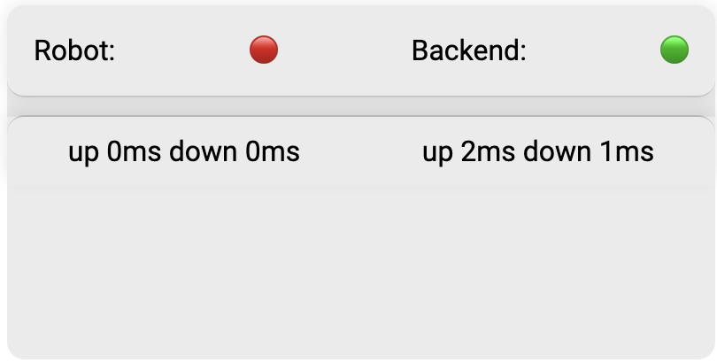
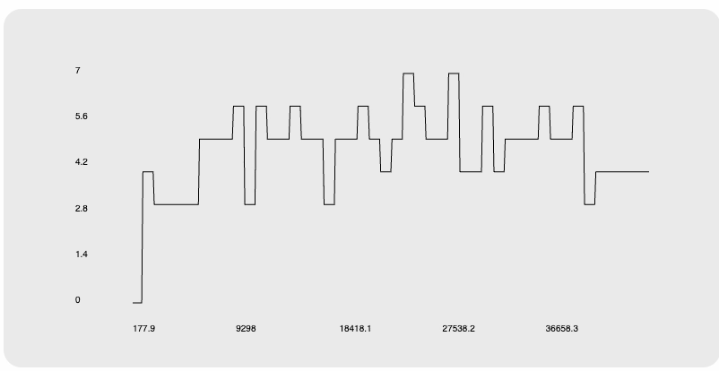
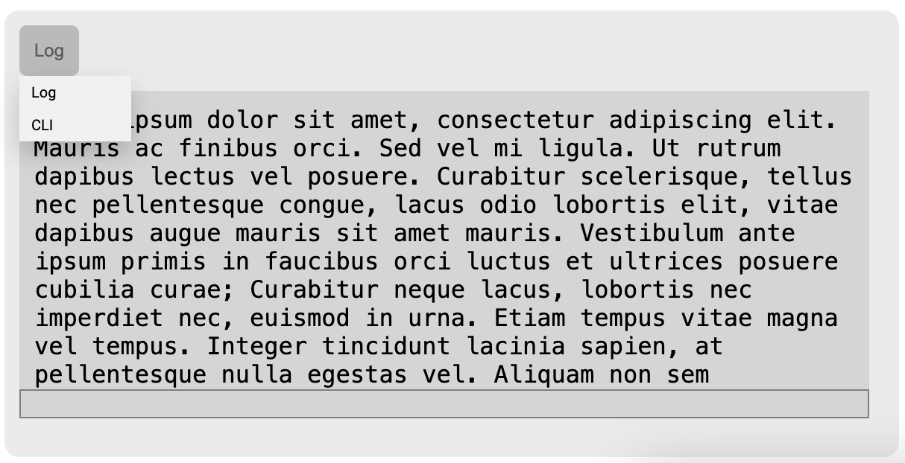
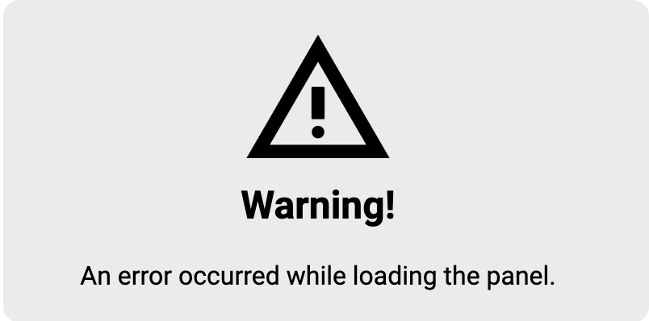
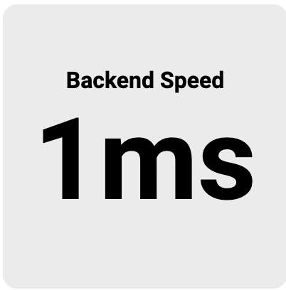

# Bot

[](https://jaidens-bot-docs.readthedocs.io/en/latest/?badge=latest) • [**Javadoc**](https://jaidenagrimminck.github.io/bot/controlling/docs/javadoc/index.html)


This is both a library and the code for a robot I'm building.

## Prerequisites

For everything, the following prerequisites are needed:

- Python 3.12
- npm >v9.6.7
- Java >19

For individual components, look at each of the component sections in this readme for their own prerequisites.

To clone the repository, run

```bash
git clone https://github.com/JaidenAGrimminck/bot.git
```

# Components

Since this repo is made up of several different components, this section details the different parts of the repo individually.

## Bot Code (Controlling/Simulation)

### Prerequisites (for the site)

Need Java >19 installed to run.

### To Use

If you haven't already, clone the repo via
```bash
git clone https://github.com/JaidenAGrimminck/bot.git
```

In the `controlling` folder, run `./gradlew clean` then `./gradlew build`.

Then to run, run `./gradlew run`.

### Docs

[See the Java Docs **here**!](https://jaidenagrimminck.github.io/bot/controlling/docs/javadoc/index.html)

## Training

https://github.com/JaidenAGrimminck/bot/raw/refs/heads/main/readme/site/videos/training.mp4

## Site

The site/frontend is what can be used to diagnose the robot's current status, condition, and remotely control/edit the robot via the page. The site is built ontop of `express` and `socket.io`, allowing for fast and live communication with backend components that communicate with the robot via ROS/sockets.

The site is fully modular as well, similar to React but very lightweight in comparison, taking <4MB for the `node-modules`, allowing for easier deployment onto something like a Raspberry Pi.

The site also utilizes `socket.io`'s websockets to be very fast and efficient, an upgrade from a REST API to using websockets saw nearly 6ms improvement per request, allowing for fast and efficient data transfer.

### Prerequisites (for the site)

Need `npm` and `node.js` installed, from [here](https://nodejs.org/en/download/package-manager).

### To Use

If you haven't already, clone the repo via
```bash
git clone https://github.com/JaidenAGrimminck/bot.git
```

In the `site` folder for the repo, run `npm install`

To run, run via `npm start` in the `site` folder.

### Modularity

The site automatically can populate and import components via the `<req-use>` component.

```html
<req-use elements="panel,dropdown" id="n"> </req-use>
```

*example importing panel and dropdown components*

Due to the modularity of the site, via a few scripts it automatically looks at the `/frontend` folder and searches for the corresponding components.

If it finds it, and it finds the `.js` file corresponding with the name, it's automatically imported.

Then, in each of the files, the function `RawElement` can be called to import the raw `.html` files of each component into the page, which can be manipulated.

Additionally, corresponding `.css` files are also automatically imported if they exist.

If the file depends on an element, for example `panel` depends on the component `graph`, a `need.txt` file can be included in the `panel` folder in the `frontend`, containing a comma-separated list of the components that need to be imported.

### Panel

The panel component is a veritile component that contains many different functions, such as displaying the status of the robot, making a graph, the log of the robot, or access to the shell.

#### Status

The status panel displays the status of the robot. Currently it just displays the connection speed between the frontend and the backend, and between the robot (but the robot isn't built yet, so just 0 for now).



*example of the status panel*

#### Graph

The graph panel displays a graph of some number of the robot, tracking some local variable over time, or some other type of updating graph.



*example graph of the uptime over time*

#### Log

The log panel displays the log of the backend, and can be switched to the CLI (not yet functional though).



*example of what the log might look like*

#### Error

If an error ever occurs, the following panel will appear. Additionally, this will appear in the `console` as a warning, giving a helpful tip on what might've gone wrong.




*example of the error panel and the error message*

### Number

The number component is quite simply just a real-time number display. This is quite useful to display things such as battery voltage, uptime, or more.



*example of the number component recording the backend speed*


# License

This project is licensed under the MIT License. See the full license in [`LICENSE`](LICENSE.md)